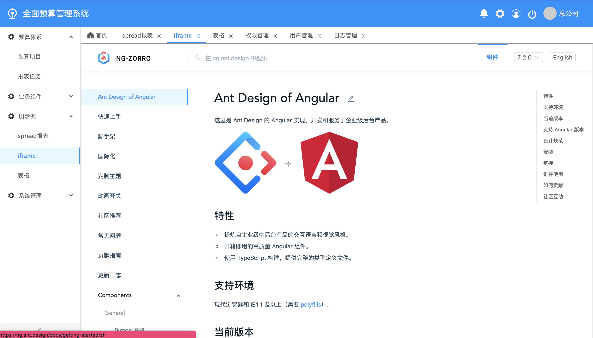

Admin template based on AntDesign and Angular8
<p align="center">
    <a href="https://travis-ci.org/fc-angular/fc-angular">
        
    </a>
    <a href="https://github.com/angular/angular">
        
    </a>
    <a href="https://github.com/NG-ZORRO/ng-zorro-antd">
        
  </a>
    <a href="https://npmcharts.com/compare/@fc-angular/core?minimal=true">
        
    </a>
    <a href="https://www.npmjs.com/package/@fc-angular/components">
        
    </a>
    <a href="https://www.npmjs.com/package/@fc-angular/core">
        
    </a>
    <a href="https://gitter.im/fc-angular/community">
        
    </a>
</p>

English | [简体中文](https://github.com/luohong123/fc-angular/blob/master/README.md)

# 一、简介

## 1、项目介绍

- 基于 angularV8，ng.ant.design V8.0.1 开发的后台管理系统
- 【码云在线预览-国内访问更快】[http://perfect_l.gitee.io/fc-angular](http://perfect_l.gitee.io/fc-angular)
- 【在线预览】[https://fe-free.github.io/fc-angular/index.html](https://fe-free.github.io/fc-angular/index.html)
- 【源码地址】[https://github.com/FE-free/fc-angular](https://github.com/FE-free/fc-angular)

> 预览效果图



## 2、 平台功能开发进度

- [x] 登录(用户名、密码、验证码)
- [x] 首页
- [x] layout
- [x] 多 tab 页路由复用策略
- [x] 退出登录
- [x] 修改密码
- [x] 系统消息(侧边栏消息)
- [x] UI 控件（Ant Design）
- [x] 引入阿里图标库
- [x] 清除本地缓存
- [x] spreadjs 报表可视化
- [x] aot 打包
- [x] 模版页面（列表、表单、详情、树列表）
- [x] iframe
- [x] threejs

# 二、安装项目

- 在 `git` 、`node`、`npm`、`vscode`  配置好多前提下，克隆代码，命令如下：

```bash
git clone https://github.com/FE-free/fc-angular.git
npm install
npm start
```

- 在浏览器中输入  http://localhost:4200 ,项目启动成功, 在`package.json` 中可修改端口号。

# 三、开发代码

<a name="98245d55"></a>

## 1、 代码规范

- 请按照 angular 官网提出的 `风格指南`  开发代码

【风格指南】[https://angular.cn/guide/styleguide#prevent-re-import-of-the-core-module](https://angular.cn/guide/styleguide#prevent-re-import-of-the-core-module)

## 2、 前后端通信

【 使用 httpclient】[https://angular.cn/guide/http](https://angular.cn/guide/http)

# 四、aot 打包部署

通过    `ng build --aot`  命令生成 dist 文件，命令如下：

```bash
ng build --aot
```

# 五、代码目录结构

```markdown
.
├── README.md # 介绍文档
├── \_mock # 测试数据
├── angular.json # 工作区中所有项目的默认 CLI 配置，包括 CLI 使用的构建选项、运行选项、测试工具选项（比如 TSLint、Karma、Protractor）等
├── node_modules # 提供给整个工作区的 npm 包
├── package-lock.json # 锁定安装时的包的版本号，并且需要上传到 git，以保证其他人在 npm install 时大家的依赖能保证一致。
├── package.json # 配置用于工作区中所有项目的包依赖项
├── proxy.config.json # 代理
├── src
│   ├── app
│   │   ├── app.README.md # 介绍文档
│   │   ├── app.component.ts
│   │   ├── app.module.ts
│   │   ├── app.route.ts # 根路由
│   │   ├── components # 组件
│   │   ├── service # 服务
│   │   └── share.service.ts # 单例服务
│   ├── assets # 静态资源文件
│   │   ├── browser # 浏览器
│   │   ├── doc # 文档
│   │   ├── fonts # 字体图标
│   │   │   ├── ali_iconfont # 阿里图标库
│   │   │   └── antdesign # antdesign 本地图标
│   │   ├── image # 图片资源
│   │   ├── plugin # 第三方插件
│   │   │   └── spread
│   │   ├── styles # 样式文件
│   ├── environments # 环境配置
│   │   ├── environment.51.ts # 其它环境配置
│   │   ├── environment.dev.ts # 开发环境配置
│   │   └── environment.prod.ts # 上线环境配置
│   ├── favicon.ico # 一个用在书签栏上的应用图标
│   ├── fccomponents # 平台组件
│   ├── fccore # 核心模块
│   │   ├── business  
│   │   ├── directive # 指令
│   │   ├── fccore.module.ts # 核心模块
│   │   ├── pipe # 管道
│   │   └── service # 服务
│   │   ├── cache.service.ts # 缓存服务
│   │   ├── common.service.ts # 公共方法
│   │   ├── dao.service.ts # httpClient 前后端通信
│   │   ├── log.service.ts # 打印服务
│   │   ├── message.service.ts # 消息服务
│   │   └── user.service.ts # 用户服务
│   ├── feature # 业务代码
│   ├── index.html # 主 HTML 文件
│   ├── karma.conf.js
│   ├── main.ts # 应用的主入口点,引导应用的根模块 AppModule 来运行在浏览器中
│   ├── polyfills.ts # 为浏览器支持提供腻子脚本
│   ├── shared # 共享模块
│   ├── styles.less # 项目的样式文件
│   ├── test.ts
│   ├── tsconfig.app.json # 继承自工作区级的 tsconfig.json 文件
│   ├── tsconfig.spec.json
│   └── tslint.json # 继承自工作区级的 tsconfig.json 文件
├── tsconfig.json # 工作区中所有应用的默认 TypeScript 配置。包括 TypeScript 选项和 Angular 模板编译器选项。
├── tslint.json # 工作区中所有应用的默认 TSLint 配置。
├── .gitignore # 指定 Git 要忽略的非跟踪的文件。
├── .editorconfig # 代码编辑器配置
└── tslint 代码检查.READE.md # 介绍文档
```

# 六、规范

<a name="98245d55"></a>

## 1、 代码规范

- 请按照 angular 官网提出的 `风格指南`  开发代码

【风格指南】[https://angular.cn/guide/styleguide#prevent-re-import-of-the-core-module](https://angular.cn/guide/styleguide#prevent-re-import-of-the-core-module)

## 2、前后端通信

【 使用 httpclient】[https://angular.cn/guide/http](https://angular.cn/guide/http)

# 七、aot 打包部署

- 通过    `ng build --aot`  命令生成 `docs` 文件，命令如下：

```bash
npm run aot
```

# 八、前端工程化

## 1、tslint

## 2、 stylelint

## 3、 commitlint

## 4、 changelog

- standard-version: 自动生成 CHANGELOG

## 5. travis

## 6. 使用 npm version 管理版本

- 官网：https://docs.npmjs.com/cli/version

# 九、学习帮助

- [【angular 官网】](https://angular.cn/docs)
- [【typescript 官网】](http://www.typescriptlang.org/index.html)<br/>
- [【ng.ant.design 官网】](https://ng.ant.design/docs/introduce/zh)
- [【if 我是前端团队 Leader，怎么制定前端协作规范?】](https://juejin.im/post/5d3a7134f265da1b5d57f1ed#heading-18)
- [【优雅的提交你的 Git Commit Message】](https://zhuanlan.zhihu.com/p/34223150)

# 十、常见问题

1、 如何修改组件内部样式？

> 注意 由于 Angular 的样式隔离，修改 ant.design 组件内的样式 需要用::ng-deep 来覆盖 NgZorro 的样式

2. 打包如何优化？
   开启 `aot` 打包，输入以下命令

```bash
npm run aot
```

`aot` 打包时，优化编译时对 ts 语法检查非常严谨，如果有错误就一个一个的去改，直到错误修改完成，`aot`打包才能通过

# Contributors

Thanks to everyone who contributed to the source code, comments, scripts, documentation, and test cases.
<a href="https://github.com/FE-free/fc-angular/graphs/contributors"></a>

`.prettierrc`、`.editorconfig` 文件配置参考自 [ng.ant.design 官方源码](https://github.com/NG-ZORRO/ng-zorro-antd/blob/master/.editorconfig)
