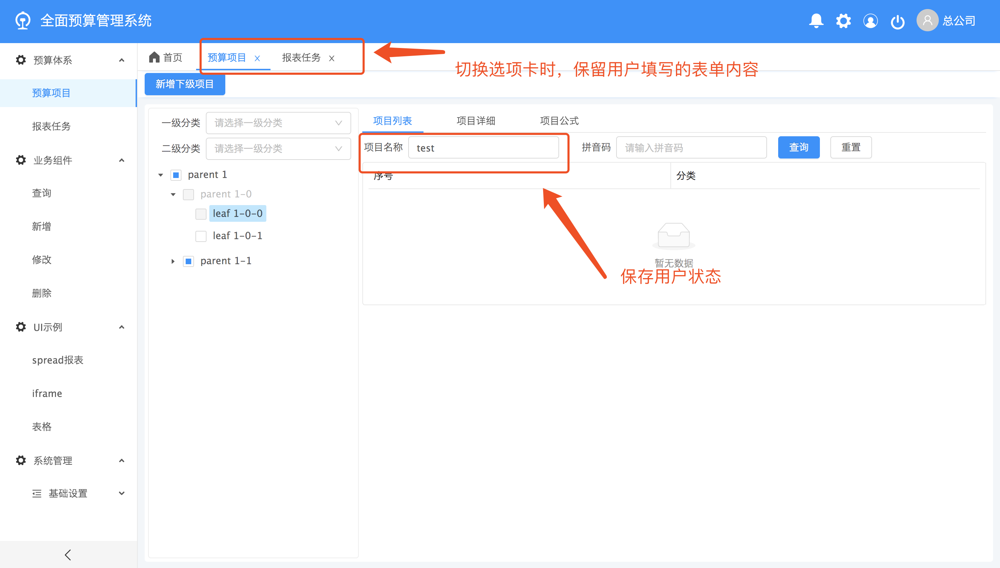

# 【fc-angular】基于angular8的多页面后台管理系统
- 【在线预览】[https://luohong123.github.io/fc-angular/demo/index.html](https://luohong123.github.io/fc-angular/demo/index.html)
- 【源码地址】[https://github.com/luohong123/fc-angular](https://github.com/luohong123/fc-angular)

# 一、简介
## 项目介绍

- 基于 angularV8，ng.ant.design V8.0.1开发的后台管理系统

> 预览效果图
- 首页

- 路由复用策略，切换路由保留用户操作状态


## 二、平台功能开发进度

- [x] 登录
- [x] 首页
- [x] layout
- [x] 多tab页路由复用策略
- [x] 退出登录
- [x] 修改密码
- [ ] 系统消息
- [ ] 用户管理
- [ ] 菜单管理
- [ ] 权限管理
- [ ] 日志管理
- [ ] 换肤
- [ ] UI控件
- [ ] 模版页面
- [x] 引入阿里图标库
- [ ] 清除本地缓存
- [ ] spreadjs报表可视化
- [x] aot打包
- 
## 三、代码目录结构

```markdown
.
├── README.md        # 介绍文档											
├── _mock	         # 测试数据													
├── angular.json	 # 工作区中所有项目的默认 CLI 配置，包括 CLI 使用的构建选项、运行选项、测试工具选项（比如 TSLint、Karma、Protractor）等
├── node_modules    # 提供给整个工作区的 npm 包
├── package-lock.json   # 锁定安装时的包的版本号，并且需要上传到git，以保证其他人在npm install时大家的依赖能保证一致。
├── package.json    # 配置用于工作区中所有项目的包依赖项
├── proxy.config.json   # 代理
├── src
│   ├── app
│   │   ├── app.README.md   # 介绍文档
│   │   ├── app.component.ts							
│   │   ├── app.module.ts									
│   │   ├── app.route.ts    # 根路由
│   │   ├── components  # 组件
│   │   ├── service # 服务
│   │   └── share.service.ts    # 单例服务
│   ├── assets  # 静态资源文件
│   │   ├── browser # 浏览器
│   │   ├── doc # 文档
│   │   ├── fonts   # 字体图标
│   │   │   ├── ali_iconfont    # 阿里图标库
│   │   │   └── antdesign   # antdesign本地图标
│   │   ├── image   # 图片资源
│   │   ├── plugin  # 第三方插件
│   │   │   └── spread
│   │   ├── styles  # 样式文件
│   ├── environments # 环境配置
│   │   ├── environment.51.ts # 其它环境配置
│   │   ├── environment.dev.ts # 开发环境配置
│   │   └── environment.prod.ts # 上线环境配置
│   ├── favicon.ico # 一个用在书签栏上的应用图标
│   ├── fccomponents    # 平台组件
│   ├── fccore  # 核心模块
│   │   ├── business  
│   │   ├── directive # 指令
│   │   ├── fccore.module.ts    # 核心模块
│   │   ├── pipe    # 管道
│   │   └── service # 服务
│   │       ├── cache.service.ts    # 缓存服务
│   │       ├── common.service.ts   # 公共方法
│   │       ├── dao.service.ts  # httpClient 前后端通信
│   │       ├── log.service.ts  # 打印服务
│   │       ├── message.service.ts  # 消息服务
│   │       └── user.service.ts # 用户服务
│   ├── feature # 业务代码
│   ├── index.html  # 主HTML文件
│   ├── karma.conf.js
│   ├── main.ts # 应用的主入口点,引导应用的根模块 AppModule 来运行在浏览器中
│   ├── polyfills.ts    # 为浏览器支持提供腻子脚本
│   ├── shared  # 共享模块
│   ├── styles.less # 项目的样式文件
│   ├── test.ts
│   ├── tsconfig.app.json   # 继承自工作区级的 tsconfig.json 文件
│   ├── tsconfig.spec.json
│   └── tslint.json # 继承自工作区级的 tsconfig.json 文件
├── tsconfig.json   # 工作区中所有应用的默认 TypeScript 配置。包括 TypeScript 选项和 Angular 模板编译器选项。
├── tslint.json # 工作区中所有应用的默认 TSLint 配置。
├── .gitignore  # 指定 Git 要忽略的非跟踪的文件。
├── .editorconfig   # 代码编辑器配置
└── tslint代码检查.READE.md # 介绍文档
```


# 四、安装项目

- 在 `git` 、`node`、`npm `、`vscode` 配置好多前提下，克隆代码，命令如下：

```bash
git clone https://github.com/luohong123/fc-angular.git
npm install
npm start
```
- 在浏览器中输入 http://localhost:4200 ,项目启动成功。

# 五、开发代码
<a name="98245d55"></a>
## 1. 代码规范

- 请按照angular官网提出的 `风格指南` 开发代码

 【风格指南】[https://angular.cn/guide/styleguide#prevent-re-import-of-the-core-module](https://angular.cn/guide/styleguide#prevent-re-import-of-the-core-module)

## 2. 前后端通信
【 使用httpclient】[https://angular.cn/guide/http](https://angular.cn/guide/http)

# 六、aot打包部署

- 通过   `ng build --aot`  命令生成dist 文件，命令如下：

```bash
ng build --aot
```

# 七、学习帮助
【angular官网】[https://angular.cn/docs](https://angular.cn/docs)<br/>
【typescript官网】[http://www.typescriptlang.org/index.html](http://www.typescriptlang.org/index.html)<br/>
【ng.ant.design官网】[https://ng.ant.design/docs/introduce/zh](https://ng.ant.design/docs/introduce/zh)
